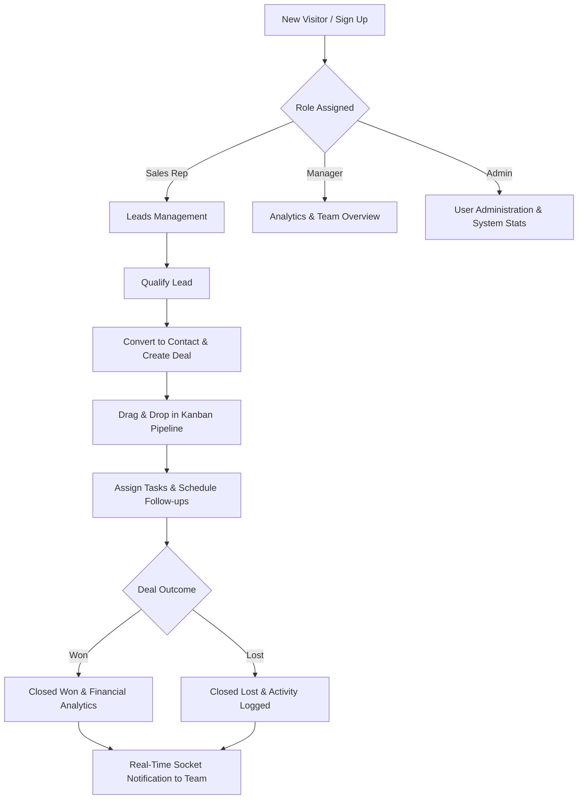

# 🚀 Cliento — Enterprise CRM Platform

[](https://react.dev/)
[](https://www.typescriptlang.org/)
[](https://vitejs.dev/)
[](https://tailwindcss.com/)
[](https://nodejs.org/)
[](https://www.mongodb.com/)
[](https://socket.io/)

**Cliento** is a full-stack Customer Relationship Management (CRM) application designed for sales teams, managers, and system administrators. It streamlines lead tracking, contact organization, deal pipeline management, task delegation, and real-time team collaboration within a modern user interface.

---

## 📋 Table of Contents

- [Overview](#-overview)
- [Key Features](#-key-features)
- [Tech Stack](#-tech-stack)
- [Architecture Diagram](#-architecture-diagram)
- [Project Directory Structure](#-project-directory-structure)
- [CRM Business Workflow](#-crm-business-workflow)
- [Getting Started](#-getting-started)
- [Environment Variables](#-environment-variables)
- [API Reference](#-api-reference)
- [Deployment](#-deployment)
- [UI Screenshots](#-ui-screenshots)
- [Future Enhancements](#-future-enhancements)
- [Author & License](#-author--license)

---

## 🌟 Overview

Cliento is built with a decoupled client-server architecture:
- **Frontend**: Single Page Application built with React 18, TypeScript, Vite, Tailwind CSS, shadcn/ui components, and Lucide icons.
- **Backend**: Express.js REST API on Node.js, utilizing Mongoose ODM for MongoDB data modeling, Nodemailer for transaction emails, Multer for file uploads, and Socket.IO for real-time WebSocket communication.

---

## ✨ Key Features

### 🔐 Authentication & Security
- **Multi-Role Access Control (RBAC)**: Distinct frontend page routing and permission-guarded navigation for `Admin`, `Manager`, and `Sales Representative` accounts, backed by user data isolation on the server.
- **Secure JWT Auth**: JSON Web Tokens with server-side token versioning for session validation and remote session invalidation.
- **Google OAuth 2.0 Integration**: One-tap sign-in capability via `@react-oauth/google` with backend Google token verification.
- **Password Reset Workflow** *(Demo Notification Flow)*: Automated password recovery notification emails sent via Nodemailer with Gmail SMTP linking to the reset portal.

### 💼 Deal Pipeline & Sales Management
- **Interactive Kanban Pipeline**: Drag-and-drop deal stage management using `@hello-pangea/dnd` with dynamic stage totals.
- **Lead & Contact Management**: Full CRUD operations for tracking prospective leads, qualification statuses, and customer contacts.
- **Deal Tracking**: Monitor deal values, close dates, probability scores, and pipeline stages (New Lead, Contacted, Qualified, Proposal Sent, Negotiation, Won, Lost).

### ⚡ Real-Time Collaboration & Productivity
- **Live Notifications & Activity Log**: Immediate Socket.IO push updates across all connected clients when deals or tasks are updated.
- **Task Management**: Assign tasks, set due dates, link tasks to specific leads or deals, and track completion states.
- **AI CRM Assistant** *(Interactive Prototype)*: Dedicated AI Chat UI providing simulated operational insights and suggestions for CRM workflows.

### 📊 Analytics & Administration
- **Interactive Analytics Dashboards**: Data visualization using `Recharts` for tracking pipeline metrics, win/loss conversion rates, and monthly revenue metrics.
- **Admin Management Portal**: Administrative controls for managing user accounts, disabling accounts, role assignments, and system monitoring.
- **User Profile Management**: Avatar upload using `Multer` multipart form processing and user profile settings.

---

## 🛠️ Tech Stack

### Frontend
- **Language**: TypeScript (TSX)
- **Framework**: React 18
- **Build Tool**: Vite (with `@vitejs/plugin-react-swc`)
- **UI Components**: shadcn/ui (Radix UI primitives)
- **Styling**: Tailwind CSS, PostCSS, `clsx`, `tailwind-merge`
- **Icons**: Lucide React
- **State & Routing**: React Context API, React Router DOM (v6)
- **HTTP Client**: Axios & Native Fetch API
- **Charts**: Recharts
- **Drag-and-Drop**: `@hello-pangea/dnd`
- **Real-Time Client**: `socket.io-client`
- **Testing**: Vitest, React Testing Library

### Backend
- **Language**: JavaScript (Node.js CommonJS)
- **Runtime**: Node.js
- **Web Framework**: Express.js (v5)
- **Database**: MongoDB
- **ODM**: Mongoose
- **Authentication**: JWT (`jsonwebtoken`) & `bcryptjs`
- **File Uploads**: Multer
- **Mail Service**: Nodemailer
- **Real-Time Server**: Socket.IO
- **Environment Management**: `dotenv`

---

## 📐 Architecture Diagram

```mermaid
flowchart TB
    subgraph Client ["Frontend (React + TypeScript + Vite)"]
        UI["shadcn/ui & Tailwind CSS"]
        Router["React Router DOM"]
        Context["Auth Context & State"]
        SocketClient["Socket.IO Client"]
    end

    subgraph Server ["Backend (Node.js + Express.js)"]
        Middleware["JWT Auth & Role Middleware"]
        Routes["REST API Routes (/api/*)"]
        Uploads["Multer Static Storage (/uploads)"]
        Mailer["Nodemailer (Gmail Transporter)"]
        SocketServer["Socket.IO WebSocket Server"]
    end

    subgraph Database ["Data Layer"]
        Mongo [("MongoDB Database")]
    end

    UI --> Router
    Router --> Context
    Context -->|HTTP / REST API| Routes
    SocketClient <-->|WebSockets| SocketServer
    Routes --> Middleware
    Middleware --> Mongo
    Routes --> Uploads
    Routes --> Mailer
```

---

## 📂 Project Directory Structure

```text
Cliento/
├── Client/                      # React + TypeScript Frontend
│   ├── public/                  # Public static assets
│   ├── src/
│   │   ├── components/          # UI components (shadcn primitives, layouts, tabs)
│   │   ├── contexts/            # Global React contexts (AuthContext.tsx)
│   │   ├── hooks/               # Custom React hooks (useDashboardStats, useLiveActivity, etc.)
│   │   ├── integrations/        # Client setup definitions
│   │   ├── lib/                 # Helper utilities (cn utility)
│   │   ├── pages/               # Main page routes (Dashboard, Pipeline, Deals, Leads, etc.)
│   │   ├── test/                # Vitest test suite (example.test.ts, setup.ts)
│   │   ├── utils/               # API utilities (api.ts with authFetch)
│   │   ├── App.css              # Custom styling definitions
│   │   ├── App.tsx              # Application root & Route declarations
│   │   ├── index.css            # Tailwind & design system CSS entrypoint
│   │   └── main.tsx             # DOM Entrypoint
│   ├── index.html
│   ├── package.json
│   ├── tailwind.config.ts
│   ├── tsconfig.json
│   ├── vite.config.ts
│   └── vitest.config.ts
│
└── server/                      # Node.js + Express Backend
    ├── middleware/              # Authorization & JWT verification middleware (auth.js)
    ├── models/                  # Mongoose Schemas (User, Lead, Deal, Task, Contact, etc.)
    ├── routes/                  # Express API Endpoints (auth, leads, deals, tasks, contacts, etc.)
    ├── uploads/                 # Static user upload storage (avatars)
    ├── utils/                   # Database & notification helper utilities (notifier.js)
    ├── server.js                # Express app initialization & Socket.IO setup
    └── package.json
```

---

## 🔄 CRM Business Workflow



---

## ⚙️ Getting Started

### Prerequisites

Ensure you have the following installed on your machine:
- **Node.js** (v18.x or later)
- **npm** package manager
- **MongoDB** (Local instance or MongoDB Atlas cluster connection string)

### 1. Clone the Repository

```bash
git clone https://github.com/your-username/cliento.git
cd cliento
```

### 2. Set Up the Backend Server

```bash
cd server
npm install
```

Create a `.env` file in the `server/` directory (see [Environment Variables](#-environment-variables)).

Start the backend server in development mode:

```bash
npm run dev
```

### 3. Set Up the Frontend Client

Open a new terminal window:

```bash
cd Client
npm install
```

Create a `.env` file in the `Client/` directory (see [Environment Variables](#-environment-variables)).

Start the Vite development client:

```bash
npm run dev
```

The application will be accessible at `http://localhost:8080`.

---

## 🔑 Environment Variables

### Backend (`server/.env`)

```env
PORT=5000
MONGO_URI=mongodb://127.0.0.1:27017/cliento
JWT_SECRET=your_jwt_secret_key_here
CLIENT_URL=http://localhost:8080
FRONTEND_URL=http://localhost:8080
GMAIL_USER=your_email@gmail.com
GMAIL_PASS=your_gmail_app_password
```

### Frontend (`Client/.env`)

```env
VITE_API_URL=http://localhost:5000
```

---

## 📡 API Reference

### Authentication & Users (`/api/auth` & `/api/users`)
| Method | Endpoint | Access | Description |
| :--- | :--- | :--- | :--- |
| `POST` | `/api/auth/signup` | Public | Register a new user account |
| `POST` | `/api/auth/login` | Public | Authenticate user & return JWT token |
| `POST` | `/api/auth/google` | Public | Google OAuth token verification |
| `POST` | `/forgot-password` | Public | Send password reset email notification |
| `GET` | `/api/users` | Authenticated | Fetch list of users for assignment |
| `PUT` | `/api/users/:id` | Admin | Update user role or disabled status |
| `DELETE` | `/api/users/:id` | Admin | Delete user account |
| `GET` | `/api/auth/profile/:id` | Private | Retrieve user profile details |
| `PUT` | `/api/auth/profile/:id` | Private | Update user profile and notification settings |
| `PUT` | `/api/auth/change-password/:id` | Private | Update user password |
| `POST` | `/api/auth/logout-all/:id` | Private | Increment token version to invalidate all sessions |

### Leads & Contacts (`/api/leads` & `/api/contacts`)
| Method | Endpoint | Access | Description |
| :--- | :--- | :--- | :--- |
| `GET` | `/api/leads` | Private | Retrieve active leads |
| `GET` | `/api/leads/:id` | Private | Get single lead details with linked deal |
| `POST` | `/api/leads` | Private | Create a new lead |
| `PUT` | `/api/leads/:id` | Private | Update lead information or status |
| `DELETE` | `/api/leads/:id` | Private | Delete a lead |
| `GET` | `/api/contacts` | Private | Retrieve contacts |
| `GET` | `/api/contacts/stats` | Private | Fetch contact metric analytics |
| `POST` | `/api/contacts` | Private | Create a new customer contact |
| `PUT` | `/api/contacts/:id` | Private | Update contact details |
| `DELETE` | `/api/contacts/:id` | Private | Delete a contact |

### Deals & Pipeline (`/api/deals`)
| Method | Endpoint | Access | Description |
| :--- | :--- | :--- | :--- |
| `GET` | `/api/deals` | Private | Fetch deals |
| `POST` | `/api/deals` | Private | Convert lead & create a new deal |
| `PUT` | `/api/deals/:id` | Private | Update deal stage, value, or notes |
| `DELETE` | `/api/deals/:id` | Private | Delete a deal |

### Tasks, Dashboard & System (`/api/tasks`, `/api/dashboard`, `/api/notifications`, `/upload`)
| Method | Endpoint | Access | Description |
| :--- | :--- | :--- | :--- |
| `GET` | `/api/tasks` | Private | Retrieve tasks |
| `POST` | `/api/tasks` | Private | Create a new assigned task |
| `GET` | `/api/dashboard/stats` | Private | Calculate dashboard metrics & KPI summaries |
| `GET` | `/api/notifications` | Private | Retrieve user notifications |
| `PUT` | `/api/notifications/:id/read` | Private | Mark notification as read |
| `POST` | `/upload` | Private | Upload user avatar image via Multer |

---

## 🚀 Deployment

### Backend Deployment (Render / Railway)
1. Push `server/` codebase to your preferred hosting platform.
2. Configure environment variables (`PORT`, `MONGO_URI`, `JWT_SECRET`, `CLIENT_URL`, `FRONTEND_URL`, `GMAIL_USER`, `GMAIL_PASS`).
3. Set build command: `npm install` and start command: `npm start`.

### Frontend Deployment (Vercel / Netlify)
1. Build the frontend for production:
   ```bash
   cd Client
   npm run build
   ```
2. Deploy the generated `dist/` directory to Vercel or Netlify.
3. Configure `VITE_API_URL` pointing to your deployed backend URL.
4. Add single-page application SPA rewrite rules (e.g., `_redirects` containing `/* /index.html 200` for Netlify or `vercel.json` rewrites for Vercel) to support React Router HTML5 pushState routing.

---

## 🖼️ UI Screenshots

| Dashboard Overview | Kanban Pipeline |
| :---: | :---: |
| *(Add Dashboard Screenshot Here)* | *(Add Pipeline Screenshot Here)* |

| Analytics & Insights | Lead Details |
| :---: | :---: |
| *(Add Analytics Screenshot Here)* | *(Add Lead Details Screenshot Here)* |

---

## 🔮 Future Enhancements

- 🤖 **Production LLM Integration**: Connect the AI Chat interface to OpenAI/Gemini APIs for dynamic CRM querying and natural language insights.
- 🔑 **Complete Self-Service Password Reset**: Add tokenized verification links for unauthenticated password resets.
- 📧 **Automated Email Sequences**: Trigger automated follow-up email drips based on deal status changes.
- 📄 **PDF & CSV Export**: Export sales reports, contact directories, and invoice summaries to PDF or CSV format.
- 📞 **VoIP Call Integration**: Direct in-browser calling and call recording logs for sales representatives.
- 🔔 **Push Notifications**: Web push notification support for urgent task reminders.

---

## 👤 Author & License

Developed by **Manya Kathuria**.

This project is licensed under the [ISC License](LICENSE).
